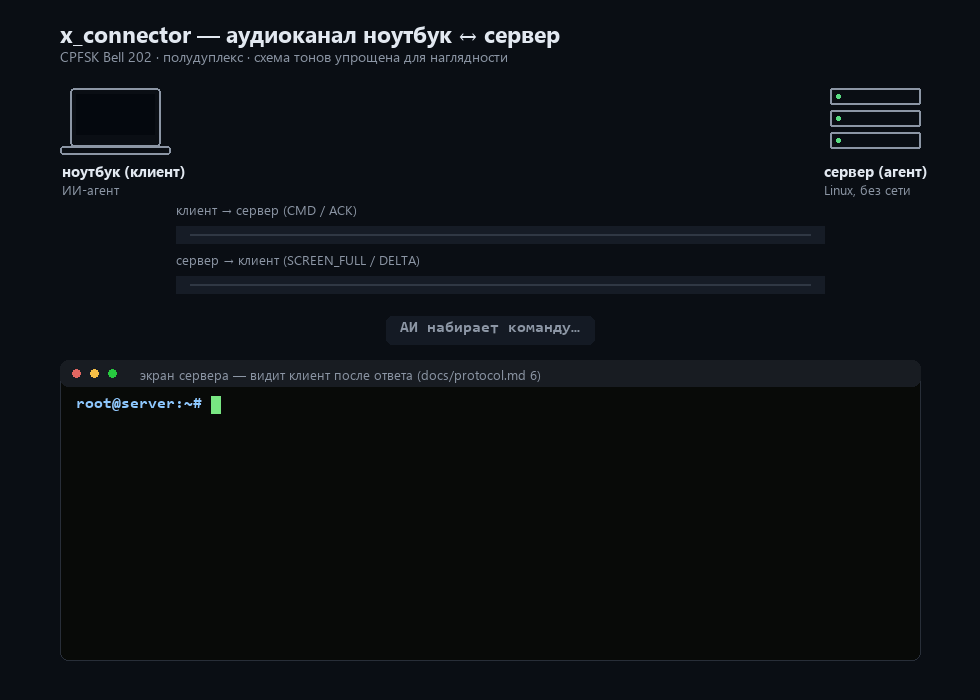

# x_connector

Внеполосная консоль между ноутбуком (Windows) и сервером (Linux) по **аудиокабелю**. Сеть, USB и радио в рабочем режиме не используются: команды идут звуком в одну сторону, обратно — текстовая картинка терминала (сетка символов, не скриншот).

Назначение — починить сломанную сеть на сервере, когда ноутбук нельзя к нему подключить обычным Ethernet/Wi‑Fi/VPN. Канал живёт на звуковой карте и поэтому не зависит от сокетов, маршрутизации, DNS и брандмауэра.

```
ноутбук ──наушники──► line-in   сервер
        ◄──микрофон── аудиовыход
```

Два провода крест-накрест — отсюда имя проекта.



Иллюстративная анимация одного полудуплексного цикла (`docs/demo/make_demo_gif.py`) — как выглядит обмен: сигнал в обе стороны и сетка терминала, которая приходит обратно.

## Что умеет сейчас

- Клиент на Windows и агент на Linux общаются одним и тем же пакетом `xconn_channel` (Python, только стандартная библиотека).
- Ввод как в консоль: строка команды, клавиша (Ctrl‑C, стрелки, Tab) или файл в обе стороны (`.put`/`.get` — кадры `FILE_*`, CRC-32).
- Обратно — снимок VT100-сетки 24×80 (cp437), целиком, дельтой или кусками `SCREEN_PART`, если экран не сжимается целиком.
- Полудуплекс с CRC и повтором кадра. Шифрования нет: оператор стоит у машины.
- Установка на сервер — с USB-флешки: `py -m xconn_channel stick E:\` пишет автономный установщик (`packaging/`: `install.sh`, systemd-unit, офлайн Python и `alsa-utils`), `sudo sh install.sh` на сервере без интернета.
- Калибровка тракта до работы: `tools/probe.py` (шум, АРУ, АЧХ, завал тонов Bell 202), `tools/ber.py` (BER/FER — синтетика и живой кабель `--live`).
- Проверка без кабеля: `loopback` гоняет оба конца в одном процессе.

**Первый прогон (2026-09-22) и приёмка первой сборки (2026-09-25):** рукопожатие, сетка 24×80 и работа без консоли сервера прошли на X-кабеле. Консоль ждёт окончания команды (не снимает экран посреди `ping` / `netplan apply`) и глотает OSC. SSH и IP поверх звука по-прежнему не делаются — они требуют тот самый сетевой стек, который в этот момент сломан.

## Быстрый старт (без кабеля)

Нужен Python 3.10+. На Windows команда — `py`.

```text
git clone https://github.com/DmNep/x_connector.git
cd x_connector
py -m unittest discover -s tests
py -m xconn_channel loopback -c "echo hello"
```

Интерактивно:

```text
py -m xconn_channel loopback --repl
```

В приглашении `xconn>` — обычная командная строка. Служебные строки:

| Ввод | Действие |
|---|---|
| `.key ctrl-c` | послать именованную клавишу |
| `.put local.conf` | передать файл на сервер, в `inbox/` |
| `.get remote.conf` | забрать файл с сервера |
| `.ping` | проверить канал |
| `.refresh` | полный снимок экрана |
| `.quit` | выход |

## Документация

| Файл | Содержание |
|---|---|
| [docs/manual.md](docs/manual.md) | Подключение кабелей, запуск клиента и агента, калибровка, диагностика |
| [docs/protocol.md](docs/protocol.md) | Тона, кадры, полудуплекс, формат экрана — спецификация канала |
| [AGENTS.md](AGENTS.md) | Контекст для ИИ-агентов и решения владельца проекта |

## Состав

| Путь | Назначение |
|---|---|
| `xconn_channel/` | общий пакет клиента и агента |
| `xconn_channel/stick.py` | запись автономного установщика на флешку |
| `xconn_channel/transfer.py` | передача файлов в обе стороны (`FILE_*`) |
| `xconn_channel/devcheck.py` | список и проверка аудио-устройств |
| `packaging/` | содержимое установочной флешки (`install.sh`, systemd-unit) |
| `tools/probe.py` | калибровка тракта (шум, АРУ, АЧХ, тона Bell 202) |
| `tools/ber.py` | измерение BER/FER — DSP-петля и живой кабель (`--live`) |
| `tools/live.py` | общий слой воспроизведения/записи для калибровки |
| `docs/demo/` | иллюстративный демо-gif обмена и генерирующий его скрипт |
| `tests/` | unittest без железа |

```text
py -m xconn_channel devices
py -m xconn_channel client --repl
py -m xconn_channel agent
py -m xconn_channel stick E:\
py tools/probe.py --selftest
py tools/ber.py --selftest
```

Подробности запуска по кабелю — в [мануале](docs/manual.md).
